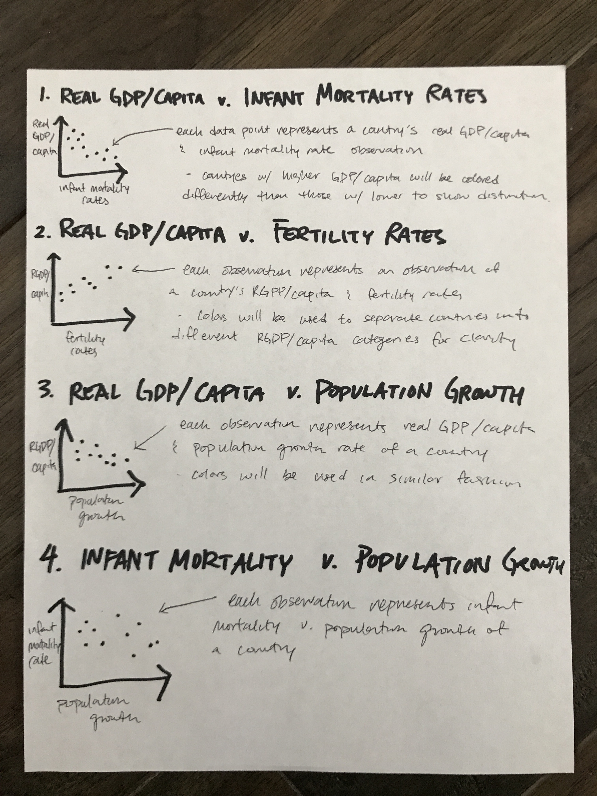

```{r setup, include=FALSE}
knitr::opts_chunk$set(echo = TRUE)

library("knitr")
source("a_6.R")
difference_in_gpd <- round(difference_gpd, 2)
difference_in_mortality<- round(difference_mortality, 2)
difference_in_fertility<- round(difference_fertility, 2)
population_in_rate<- round(population_rate, 2)
fert_popgrowth_2015 <- round(difference_fert_popgrowth_2015, 2)
fert_popgrowth_2010<- round(difference_fert_popgrowth_2010, 2)
greatest_diff
```
#Section 1

## Problem Domain
The problem domain for this report is to understand the potential effects of the financial status of a country on parameters such as healthcare and education. We have selected variables that we belive to some extent reflect these parameters.  <br /> 

`population_data` represents information about fertility and infant mortality rates based on country. <br />
`gdp_data` represent the gross domestic product and gdp growth rates of a country. GDP is represented by a country's consumption + investments + government expenditures + exports - imports. GDP is a rough indicator of a country's financial wellbeing/development.

In `population_data`, The infant mortality rate is the number of deaths under one year of age occurring among the live births in a given geographical area during a given year, per 1,000 live births occurring among the population of the given geographical area during the same year. <br /> Life expectancy, estimate of the average number of additional years that a person of a given age can expect to live. The most common measure of life expectancy is life expectancy at birth. Life expectancy is a hypothetical measure. It assumes that the age-specific death rates for the year in question will apply throughout the lifetime of individuals born in that year. The estimate, in effect, projects the age-specific mortality (death) rates for a given period over the entire lifetime of the population born (or alive) during that time. The measure differs considerably by sex, age, race, and geographic location. The maternal mortality rate is calculated in a manner similar to infant mortality rate. <br /> A major difference however, is that it is calculated per 100,000 members of population. The data also contains, the rate of population increase annually as a percentage. Total fertility rate. Definition: The number of children who would be born per woman (or per 1,000 women) if she/they were to pass through the childbearing years bearing children according to a current schedule of age-specific fertility rates. 

`gdp_data` includes gdp calculated in terms of US dollars with 2010 as the base year as well as with 2018 as the base year. It also includes per capita gdp and real GDP rates of growth. This value negates the effects of inflation on GDP. 

This domain is worthy of analysis because it allows us to analyze how GDP either national or per capita correlates with a nations fertility rate, maternal mortality rate, population rate, and life expectancy. <br /> 

This will allow us to determine if Gross Domestic Product has any potential  influence on these factors. The basic assumption is that the GDP of a country contributes to its development in healthcare facilities and education facilities. The purpose of this analysis is to determine whether a countries choice of resource allocation has a significant impact in its progress in these domains. 


##Critical Analysis Questions
1. What is the correlation between the Real GDP per capita vs Infant Mortality Rates?
    - GDP per capita is an indicator of an average household's wealth, therefore higher GDP should result to more access to healthcare. We think that countries with **higher** GDP per capita should have **lower** infant mortality rates. Although this is just a preliminary hypothesis. 
    
2. What is the correlation between Real GDP per capita vs. Fertility Rates?
    - We wanted to look at the relationship between average household's wealth and the how many kids a family has? We predict that GDP per capita **increases** will lead to **decreases** in fertility rates. This is a preliminary hypothesis based on the hypothesis that countries with low per capita GDP have lower quality healthcare.
    
3. What is the relationship betwen Real GDP per capita vs. Population Growth Rates?
    - We wanted to take a look at the same relationship with population growth rates. Population Growth Rates are equal to Fertility Rates - Death Rate + Rate of Immigration. 
    
4. What is the relationship between fertility rates and Population Growth Rates? 
    - This question is of significance because people tend to believe low income contries have high fertility rates and high population growth rates. The primary difference in these calculations is the presence of immigration. Observing the difference in them will give us the immigration effect which is also an important factor to consider vis-a-vis the gdp per capita of a country. 


Sources : https://www.britannica.com/science/life-expectancy ,
         https://stats.oecd.org/glossary/detail.asp?ID=1347

# Section 2

##Data Description

We collected data on various health statistics and the GDP with different base years as well as per capita GDP of different countries. This data are then joined by country and by year in following sections.

The data comes from [data.un.org](http://data.un.org), the public data base of the United Nations. The data originated from the Statistical Yearbook, issued by the UN Department of Economic and Social Affairs Statistical Division. 

[Population Data](http://data.un.org/_Docs/SYB/PDFs/SYB60_T03_Population%20Growth,%20Fertility%20and%20Mortality%20Indicators.pdf)

[GDP Data]( http://data.un.org/_Docs/SYB/PDFs/SYB61_T13_GDP%20and%20GDP%20Per%20Capita.pdf)


```{r raw_data, echo = FALSE}
raw_population_data <- kable(x[1:15, ])
raw_GDP_data <- kable(y[1:15, ])
```
```{r by_country_data, echo = FALSE}
population_data_by_country <- kable(population_data_by_country[1:15, ])
GDP_data_by_country <- kable(gdp_data_by_country[1:15, ])
```

**Technical definitions for all jargon used in columns are included in Section 1**

### Raw population Data
- **Region/Country/Area** indicates the uniqe numerical id of that particular nation or region.
- **Region** indicates the name of the region or country.
- **Year** indicates the year that the data represents.
- **Series** indicates the specific data that the row observes.
- **Value** indicates the numerical value (observation) that corresponds with Series column. 
- **Footnotes** indicates additional information on what the data represents. 
- **Source** indicates the data's specific source.

`r raw_population_data`


### Raw GDP data

- **Region/Country/Area** indicates the uniqe numerical id of that particular nation or region.
- **Region** indicates the name of the region or country.
- **Year** indicates the year that the data represents.
- **Series** indicates the specific data that the row observes.
- **Value** indicates the numerical value (observation) that corresponds with Series column. 
- **Footnotes** indicates additional information on what the data represents. 
- **Source** indicates the data's specific source.

`r raw_GDP_data`

###Population Data by Country
- **Region** indicates the name of the region or country.
- **Year** indicates the year that the data represents.
- **Infant mortality for both sexes (per 1,000 live births)** indicates the values of The Infant mortality for both sexes
- **Life expectancy at birth for both sexes (years)** indicates the values of Life expectancy at birth for both sexes in years
- **Life expectancy at birth for females (years)** indicates the values of Life expectancy at birth for females in years. 
- **Life expectancy at birth for males (years)** indicates the values of Life expectancy at birth for males in years. 
- **Maternal mortality ratio (deaths per 100,000 population)** indicates the values of Maternal mortality ratio deaths per 100,000 people.
- **Population annual rate of increase (percent)** indicates the percentage of the annual increase in population.
- **Total fertility rate (children per women)** indicates the Total fertility rate.

`r population_data_by_country`

###GDP data by country
- **Region** indicates the name of the region or country.
- **Year** indicates the year that the data represents.
- **GDP in constant 2010 prices (millions of US dollars)** indicates the GDP in 2010 dollars. 
- **GDP in current prices (millions of US dollars)** indicates the GDP in current dollar value.
- **GDP per capita (US dollars)** indicates the total GDP divided by the total population of the nation.
- **GDP real rates of growth (percent)** indicates the growth rate of the GDP

`r GDP_data_by_country`

# Section 3

##Summary and descriptive statistics
```{r, echo=FALSE}
avg_2010 <- kable(averages_2010)
avg_2015 <- kable(averages_2015)
mn_2010 <- kable(min_2010)
mn_2015 <- kable(min_2015)
mx_2010 <- kable(max_2010)
mx_2015 <- kable(max_2015)
sdv_2010 <- kable(sd_2010)
sdv_2015 <- kable(sd_2015)
```
###Average Data 2010
`r avg_2010`
###Average Data 2015
`r avg_2015`
###Minimums for 2010
`r mn_2010`
###Minimums for 2015
`r mn_2015`
###Maximums for 2010
`r mx_2010`
###Maximums for 2015
`r mx_2015`
###Standard Deviation for 2010
`r sdv_2010`
###Standard Deviation for 2015
`r sdv_2015`


## High Level General Answers
1. What is the correlation between the Real GDP per capita vs Infant Mortality Rates?
    - The data proves, over the period of 5 years the average GDP price increased by `r difference_in_gpd` while the rate of infant mortalility decreased by `r difference_in_mortality` over the period of 5 years.
    
2. What is the correlation between Real GDP per capita vs. Fertility Rates?
    - The data proves, over the period of 5 years the average of GDP per capita increases by `r difference_in_gpd` while the rate of the fertility rate decreased by `r difference_in_fertility` over the period of 5 years. 
    
3. What is the relationship betwen Real GDP per capita vs. Population Growth Rates?
    - The data proves, over the period of 5 years the average of GDP per capita increases by `r difference_in_gpd` while the rate of the rate of population decreased by `r population_in_rate` over the period of 5 years. 
    
4. What is the relationship between Infant Mortality and Population Growth Rates?
    - The data proves, over the period of 5 years, the rate of infant mortality decreased by `r difference_in_mortality` while the rate of the population growth decreased by `r population_in_rate` over the period of 5 years. 
    - The average difference between fertility and population rate for 2010 was `r fert_popgrowth_2010` and for 2015 the average difference was `r fert_popgrowth_2015`.
    - **`r greatest_diff`** has the greatest difference in fertility rate and population     
    
## Section 4

This are our proposed data visualizations. They are can be changed when more insightful analysis is performed on the data.

 